<h1 align="center">AsyncResponse</h1>

<p align="center">
  
</p>

<p align="center"><b>
Turn correlated messages into ordinary .NET <code>await</code>s — with progress handling,
subscribe-before-send safety, and optional crash recovery and checkpointed flows.
</b></p>

<p align="center">
  <a href="https://github.com/Sky4CE/AsyncResponse/actions/workflows/ci.yml"></a>
  <a href="https://sky4ce.github.io/AsyncResponse/coverage/"></a>
  <a href="https://sky4ce.github.io/AsyncResponse/coverage/"></a>
  <a href="https://www.nuget.org/packages/AsyncResponse.Core"></a>
  <a href="LICENSE"></a>
</p>

```csharp
OrderResult result = await asyncResponse
    .For<OrderResult>()                                       // correlation id generated for you
    .Until(r => r.Status != OrderStatus.Processing)           // consume progress messages
    .WaitAsync(context =>                                     // looks sync, is fully async
        paymentGateway.StartAsync(orderId, context.CorrelationId)); // sent only AFTER subscribing
```

AsyncResponse is the correlation and recovery layer between your application and asynchronous
infrastructure. It does not replace your broker, webhook, or worker system; it removes the waiter
registry, polling loop, timeout plumbing, and recovery routing that applications otherwise build
around them.

---

## Why teams choose AsyncResponse

- **The API closes the response race.** `For<T>()` requires a trigger and runs it only after the
  waiter is registered. `For<T>(correlationId)` attaches to work started elsewhere and forbids a
  trigger. The compiler keeps those two cases separate.
- **Progress is part of the wait.** `Until(...)` consumes intermediate messages and completes on
  the terminal payload without another queue or state machine.
- **Late responses are domain-aware.** When a waiter disappeared during a restart,
  `OnRecovery()` routes the payload — materialized as the registered payload type, never raw
  broker JSON — to a resume or failure callback, or keeps the registration armed for a non-terminal
  checkpoint, instead of blindly treating every response as success.
- **Infrastructure is replaceable.** Choose one response channel, one worker transport, and one
  flow-state store independently. Move any axis from in-memory to Redis, NATS, a database, Kafka,
  RabbitMQ, or a cloud service through DI while application and flow code stay the same.
- **Multi-step work can stay plain C#.** Durable flows checkpoint named steps, re-attach
  in-flight waits, and preserve terminal payloads received during a restart—without
  replay-determinism rules or a generated workflow DSL.
- **Time is a first-class citizen.** Flows sleep durably for minutes or months
  (`flow.DelayAsync`), worker jobs can be scheduled with native broker delays, and flows start on
  cron schedules with replica-safe, exactly-once occurrences — then all of it runs instantly in
  tests on the `AsyncResponse.Testing` virtual clock.
- **Duplicate work is fenced across replicas.** Built-in flow stores combine atomic idempotent
  start, optimistic revisions, and renewable execution leases, so duplicate worker deliveries do
  not run the same flow concurrently.
- **It is built to be operated.** OpenTelemetry-compatible traces and metrics, readiness health
  checks, recovery scans, bounded early-ACK queues, dead-letter support, and callback authorization
  are first-class features.
- **The local hot path is small.** The checked-in BenchmarkDotNet suite measures the complete
  subscribe → publish → complete cycle, while the stress harness checks isolation, cleanup,
  fan-out, timeouts, context propagation, transport dispatch, and durable flows.
- **Trim- and Native AOT-compatible.** Every package builds warning-free with
  `IsAotCompatible=true`: internal serialization is source-generated, payload types plug in
  through one startup registration, and CI publishes and runs a fully trimmed Native AOT sample.
  See [docs/aot.md](docs/aot.md).

## Pick the smallest setup that fits

Channel, transport, and flow-state storage are independent choices, and every app selects one of
each:

| You need | Response channel | Worker transport | Durable-flow store |
|---|---|---|---|
| Local development, tests, or one process | In-memory | In-memory | In-memory |
| Waiter recovery across restarts | Redis, NATS, PostgreSQL, SQL Server, or MongoDB | Any | In-memory, unless flow ledgers must also survive |
| Jobs on an existing broker or cloud queue | Any | Redis, RabbitMQ, Azure Service Bus, Google Pub/Sub, SQS, Kafka, NATS, PostgreSQL, SQL Server, or MongoDB | In-memory or a provider-backed store |
| Checkpointed multi-step orchestration | Prefer a durable channel | Any | SQL Server, PostgreSQL, MySQL, SQLite, Oracle, MongoDB, Cosmos DB, DynamoDB, EF Core, or custom |

Use in-memory for the shortest path. Add a durable channel when waiter recovery state must outlive
the process, and choose a provider-backed flow store when flow ledgers must outlive it. Selecting a
store completes registration; no ledger or flow execution is created until the application calls
`IDurableFlows`.

## Install and run

```bash
dotnet add package AsyncResponse.Core

# Add exactly one channel when in-memory is not enough:
dotnet add package AsyncResponse.Channels.Redis

# Add exactly one transport when jobs use a broker or queue:
dotnet add package AsyncResponse.Transports.RabbitMQ

# Add exactly one provider-backed flow store when ledgers must survive restarts:
dotnet add package AsyncResponse.DurableFlows.PostgreSQL

# In test projects: the deterministic engine harness + virtual clock:
dotnet add package AsyncResponse.Testing
```

Packages target .NET 8 and .NET 10. `AsyncResponse.Abstractions` contains contracts only and is the
package to reference from class libraries that define payloads or flows.
The [provider examples](docs/provider-examples.md) page lists the exact package and a copy/paste
registration for every channel, transport, and flow store.

The complete process-local setup selects all three components in one chain:

```csharp
using AsyncResponse;

var builder = WebApplication.CreateBuilder(args);

builder.Services
    .AddAsyncResponse()
    .WithInMemoryChannel()
    .WithInMemoryTransport(options =>
    {
        options.QueueCapacity = 1_024; // publishers wait asynchronously when full
        options.WorkerCount = 1;       // raise for independent jobs that may run concurrently
    })
    .WithInMemoryDurableFlows();
```

`AddAsyncResponse()` deliberately selects no channel, transport, or durable-flow store. Startup
validation fails fast if the application omits any one of them, so incomplete wiring cannot silently
strand waiters, worker jobs, or flow state. `.WithInMemoryDurableFlows()` is the zero-infrastructure
choice when durable flows are unused or process-local state is intentional. The values above are the
in-memory transport defaults; the bounded queue keeps a local load spike from becoming an unbounded
allocation spike. For production combinations, jump to
[Pick your channel, transport, and flow store](#pick-your-channel-transport-and-flow-store)
and [Production setup](#production-setup).

## The problem it solves

You call a remote system (another service, an Airflow DAG, a payment gateway, a long-running job)
and the answer comes back **later, on a different channel** — a broker topic, a webhook, a callback
queue. Correlating that answer back to the code that asked for it usually means hand-rolled
`TaskCompletionSource` registries, polling loops, or callback spaghetti.

And then the hard part: **your service redeploys while it's waiting.** The in-memory waiter is gone.
The response arrives anyway. Drop it and the flow hangs "in progress" forever; blindly resume it and
you just resumed the **happy path on a failed response**.

AsyncResponse makes the simple case process-local and adds infrastructure only when the required
durability or transport semantics demand it.

## How it works



Three layers, one decision each, made exactly where its deciding fact is knowable:

| Layer | Knowable fact | Decision |
|---|---|---|
| **Ingress** (`IAsyncResponseIngress`) | "Does the message parse?" | Parses → deliver as payload, untyped and uninterpreted. Doesn't parse → report as exception. |
| **Response channel** (`SetResponse`/`SetException`) | "Did any subscriber receive it?" | Delivered → the active waiter's `Until` and flow code interpret it. Nobody listening → hand to the dispatcher. |
| **Lost-subscriber dispatcher** | "What should this late response do to the flow?" | `OnRecovery()` Resume → resume callback. Fail (or unclassifiable) → failure callback. KeepWaiting (non-terminal checkpoint) → nothing fires; the registration stays armed for the terminal response. Callbacks receive the materialized payload. |

A failed payload is **still a valid response** for an active waiter — your `Until` predicate and
flow code want to see it (persist details, decide to retry, throw a rich domain error).
Recovery classification is consulted only when nobody is listening — which is exactly when
somebody has to make the call. Full model: [docs/recovery.md](docs/recovery.md).

### Guarantees and boundaries

- For a generated correlation id, the waiter and its recovery state exist before the trigger runs.
- One terminal outcome wins a waiter; timeout, disposal, trigger failure, and completion all clean
  up the registration.
- Completion predicates for one waiter never run concurrently. Internal overload is backpressured through
  bounded in-process queues instead of growing an unbounded delegate or job backlog.
- PostgreSQL, SQL Server, and MongoDB treat notifications and change streams as wake hints:
  retained messages are keyset-paged to exhaustion, so a terminal response cannot be stranded
  behind one full progress batch. Subscriber heartbeats are batched by channel instance and
  interval instead of scheduling one timer and write per waiter.
- A durable channel persists waiter recovery metadata. It does **not** make every response path
  exactly-once: Redis pub/sub is at-most-once, while broker and queue transports can redeliver.
- Handlers, worker jobs, durable-flow steps, and outbound triggers should therefore be idempotent.
  Provider-specific ACK, retry, ordering, and dead-letter behavior is documented in
  [configuration](docs/configuration.md) and [operations](docs/operations.md).

## Durable flows

Compose those waits into whole processes. A **durable flow** is a multi-step orchestration written
as plain sequential C#. The library checkpoints named step results and pending waits so completed
work can be skipped and an interrupted flow can continue after a crash or redeploy:

```csharp
public sealed class TenantProvisioningFlow(
    IWorkspaceService _workspaces,
    IMigrationService _migrations,
    INotifier _notifier)
    : IDurableFlow<ProvisioningInput>
{
    public async Task ExecuteAsync(IDurableFlowContext flow, ProvisioningInput input)
    {
        var ws = await flow.StepAsync("create-workspace",          // local step: result is
            () => _workspaces.CreateAsync(input.TenantId));        // checkpointed after success

        var migration = await flow.AwaitStepAsync<MigrationResult>("run-migration",
            trigger: cid => _migrations.StartAsync(input.TenantId, cid),   // remote step: durably
            until: r => r.Status != MigrationStatus.Running);              // awaited, progress-aware

        if (migration.Status == MigrationStatus.Failed)
            throw new DurableFlowFailedException(migration.Message!);      // terminal, no retry

        await flow.DelayAsync("settle", TimeSpan.FromDays(1));             // durable timer: suspends —
                                                                           // no worker, lease, or memory
                                                                           // held; crashes resume the
                                                                           // remainder, never restart it

        await flow.StepAsync("notify", () => _notifier.SendAsync(input.TenantId));
    }
}

// Durable flows are explicit: register the flow class and exactly one atomic state store.
var sqlServerConnectionString = builder.Configuration.GetConnectionString("SqlServer")
    ?? throw new InvalidOperationException("ConnectionStrings:SqlServer is required.");

builder.Services.AddScoped<TenantProvisioningFlow>();
builder.Services.AddAsyncResponse()
    .WithSqlServerChannel(options =>
        options.ConnectionString = sqlServerConnectionString)
    .WithSqlServerTransport(options =>
        options.ConnectionString = sqlServerConnectionString)
    .WithSqlServerDurableFlows(options =>
        options.ConnectionString = sqlServerConnectionString)
    // Optional: start a flow on a schedule — replica-safe, exactly one run per occurrence,
    // no leader election (deterministic ids dedup through the store's atomic create).
    .WithScheduledFlow<TenantProvisioningFlow, ProvisioningInput>(
        "nightly-reprovision", "0 6 * * *", occurrence => new ProvisioningInput(TenantId: 0));

var flowId = await _flows.StartAsync<TenantProvisioningFlow, ProvisioningInput>(new(tenantId));
```

- **Checkpointed resume** — completed steps are skipped, pending waits re-attach before retry
  rules run, and lost-subscriber recovery callbacks are wired automatically. A terminal payload
  received while the process is down is checkpointed directly into its pending step before the run
  resumes; it is not discarded and then waited for again.
- **Replica-safe execution** — a caller-supplied flow id is created atomically, every checkpoint is
  compare-and-swap protected, and one renewable lease owns execution. Duplicate deliveries become
  cheap no-ops while a worker is active; an expired lease lets another replica take over. Retrying
  `StartAsync` is idempotent only for the same flow and input; conflicting id reuse fails fast.
- **Durable timers and cron schedules** — `await flow.DelayAsync("payment-window",
  TimeSpan.FromDays(3))` sleeps as a checkpoint (crashes resume the remainder), and on
  delayed-capable transports a sleeping run suspends entirely — no worker, lease, or memory
  while it sleeps. `WithScheduledFlow<TFlow, TInput>("nightly", "0 6 * * *", …)` starts flows on
  cron with exactly-once occurrences across replicas and no leader election. See
  [docs/timers-and-scheduling.md](docs/timers-and-scheduling.md).
- **Edit flows like code** — insert, reorder, or branch steps with ordinary C#; in-flight runs
  pick up compatible changes on resume. Stable step keys preserve existing checkpoints; changing
  a key intentionally creates a new step.
- **Storage is explicit** — `AddAsyncResponse()` never hides flow ledgers in the channel cache.
  Complete every registration with `.WithInMemoryDurableFlows()` for one process, an
  `AsyncResponse.DurableFlows.*` provider such as `.WithSqlServerDurableFlows(...)`, or
  `.WithDurableFlows<MyFlowStateStore>()` for an application-owned implementation.
- **Tested like the rest of the library** — a crash-at-every-checkpoint unit matrix, end-to-end
  integration runs against every durable channel, and a concurrent-flow stress scenario gating CI.
- **And testable by *your* tests** — the `AsyncResponse.Testing` package runs the complete
  engine in-process on a virtual clock: script replies to awaited steps, skip a three-day timer
  in a microsecond, inject a crash at any checkpoint, and simulate a restart with real
  lost-subscriber recovery — no brokers, no sleeps, no instrumentation in your flow classes. See
  [docs/testing.md](docs/testing.md).

```csharp
await using var harness = await FlowTestHarness.StartAsync(o =>
    o.ConfigureAsyncResponse = b => b.WithDurableFlow<TenantProvisioningFlow, ProvisioningInput>());

harness.CrashAfterStep("create-workspace");            // die between checkpoint and next step
var run = await harness.StartFlowAsync<TenantProvisioningFlow, ProvisioningInput>(new(7));
await harness.AdvanceAsync(TimeSpan.FromSeconds(2));   // redelivery backoff elapses virtually

await run.WaitForAwaitingStepAsync("run-migration");   // durably parked; reply as the remote system
await run.ReplyAsync(new MigrationResult { Status = MigrationStatus.Completed });

await run.WaitForTimerStepAsync("settle");             // the one-day timer parks the run…
await harness.AdvanceAsync(TimeSpan.FromDays(1));      // …and virtual time skips it

Assert.Equal(FlowRunStatus.Succeeded, await run.WaitForFinishedAsync());
Assert.Equal(1, run.StepExecutions("create-workspace")); // crash cost a delivery, not a side effect
```

> [!IMPORTANT]
> Durable flows provide **checkpointed, at-least-once execution**, not distributed exactly-once
> side effects. A crash after an external side effect but before its checkpoint can repeat that
> side effect, so step operations and triggers must be idempotent. Built-in state-store packages
> prevent concurrent execution with atomic creation, optimistic revisions, and renewable leases;
> those fences cannot make an external API call and the following state write one transaction.

Common flow-engine settings live beside the selected store's settings in the same callback:

```csharp
builder.Services.AddAsyncResponse()
    .WithInMemoryChannel()
    .WithInMemoryTransport()
    .WithInMemoryDurableFlows(options =>
    {
        options.StateExpiry = TimeSpan.FromDays(14);
        options.ExecutionLeaseDuration = TimeSpan.FromMinutes(1);
        options.ExecutionLeaseRenewInterval = TimeSpan.FromSeconds(20);
        options.ProgressPersistenceInterval = TimeSpan.FromSeconds(1);
    });
```

Rapid `ReportProgressAsync` calls are coalesced until the next checkpoint or terminal outcome to avoid
rewriting the whole flow ledger for every progress tick; set
`ProgressPersistenceInterval = TimeSpan.Zero` when every report must be written immediately.

There is one atomic `IFlowStateStore` contract for every store: insert-if-absent start,
revision-checked checkpoints, and acquire/renew/release execution leases. Custom stores do not get
an unsafe local-lock fallback. This keeps the correctness model identical from development through
multi-replica production; only the explicit in-memory store is process-local.

The full guide — rules, failure modes, compensation, testing your flows, and app-owned state
stores — is [docs/durable-flows.md](docs/durable-flows.md).

**Durable-flow state stores** — exactly one required; use the in-memory store from
`AsyncResponse.Core` or a provider package for restart-safe ledgers:

| Store package | Registration |
|---|---|
| SQL Server | `.WithSqlServerDurableFlows(...)` |
| PostgreSQL | `.WithPostgreSqlDurableFlows(...)` |
| MySQL / MariaDB | `.WithMySqlDurableFlows(...)` |
| SQLite | `.WithSqliteDurableFlows(...)` |
| Oracle | `.WithOracleDurableFlows(...)` |
| MongoDB | `.WithMongoDbDurableFlows(...)` |
| Azure Cosmos DB | `.WithCosmosDurableFlows(...)` |
| DynamoDB | `.WithDynamoDbDurableFlows(...)` |
| Entity Framework Core (any relational provider) | `.WithEFCoreDurableFlows<TDbContext>(...)` |

See [durable-flow state stores](docs/durable-flow-state-stores.md) for a copy/paste registration for
every store, plus schema ownership, fail-fast provisioning rules, and the atomic custom-store
contract.

## Pick your channel, transport, and flow store

A **channel** delivers responses to waiters and persists recovery state. A **transport** moves
worker jobs and inbound responses through a broker. A **flow store** owns checkpoint ledgers and
execution leases. They are independent axes — combine any one of each.

**Channels** (`AsyncResponse.Channels.*`) — exactly one required:

| Channel | Delivery | Recovery durability |
|---|---|---|
| In-memory (in `Core`) | in-process | process lifetime |
| Redis | pub/sub push, zero polling | TTL'd Redis keys |
| NATS | core request/reply — "no responders" is a positive lost-waiter signal | JetStream Key-Value |
| PostgreSQL | `LISTEN/NOTIFY` wake + keyset-paged table scan—notifications carry only ids, so response size is not constrained by `NOTIFY` | row per waiter registration, database-clock TTLs |
| SQL Server | adaptive keyset-paged sweep (tight while waiters exist, backed off while idle); same-process deliveries skip the sweep entirely | row per waiter registration, database-clock TTLs |
| MongoDB | change-stream wake + keyset-paged collection scan—requires a replica set (single-node is enough); degrades to polling on standalone servers | document per waiter registration, native TTL indexes |

**Transports** (`AsyncResponse.Transports.*`) — exactly one required:

| Transport | Broker mechanics |
|---|---|
| In-memory (in `Core`) | bounded in-process queue; configurable capacity and worker concurrency |
| Redis | Redis Streams consumer groups, pending-entry retry, poison-entry discard, dead-lettering |
| RabbitMQ | publisher confirms + mandatory routing, dead-letter exchange |
| Azure Service Bus | peek-lock ACKs; reuses your own `ServiceBusClient` (e.g. Azure Identity) if registered |
| Google Pub/Sub | streaming pull; redelivery bounds via the subscription's DeadLetterPolicy |
| AWS SQS | long-poll `ReceiveMessage` (up to 10/batch), visibility-timeout redelivery, native dead-letter via redrive policies (provisionable with `CreateQueues`), opt-in FIFO ordering per flow; reuses your own `IAmazonSQS` if registered |
| Kafka | classic consumer groups, manual offset management, in-process bounded retry, `{topic}.deadletter` topics; also covers Redpanda / Amazon MSK / WarpStream / Aiven / Confluent Cloud |
| NATS | JetStream explicit ACKs, NAK-with-delay redelivery, dead-lettering |
| PostgreSQL | queue table claimed with `FOR UPDATE SKIP LOCKED`, idempotent publish, dead-lettering |
| SQL Server | queue table claimed with `UPDLOCK, ROWLOCK, READPAST` (the `SKIP LOCKED` equivalent), idempotent publish, dead-lettering |
| MongoDB | queue collection claimed atomically with `findOneAndUpdate` (server-clock leases, `lock_id` fences), idempotent publish, deterministic dead-letter ids; change-stream wake on replica sets |

Every transport ships hosted subscribers for worker jobs and response ingress with two ACK modes:
the default acknowledges only after your handler completes; opt-in **early ACK** trades that
guarantee for throughput, with an explicitly bounded in-process queue, a drain budget validated
against host shutdown, and post-ACK failures surfaced through `OnBackgroundFailure`. Per-transport
semantics: [docs/configuration.md](docs/configuration.md). Copy/paste registration for every
channel and transport: [provider examples](docs/provider-examples.md).

**Redis-compatible servers.** The Redis channel and transport speak RESP through
`StackExchange.Redis`, so they run unchanged on Redis-compatible servers. **Valkey** is validated
end-to-end as both channel and transport, rechecked by a weekly CI matrix; **Dragonfly** is
validated as both against a live server (its container entrypoint differs from the redis image, so
it runs outside the Aspire CI harness); **Garnet** implements the pub/sub + string + `SCAN` surface
the channel needs but has no stream commands, so it works as a channel but not as this transport. That covers the managed options too — Amazon ElastiCache /
MemoryDB and Azure Managed Redis. Details in [docs/configuration.md](docs/configuration.md#redis-compatible-servers).

## Production setup

The registration shape is always the same: engine + one channel + one transport. The examples
below show complete, representative combinations. The
[provider examples](docs/provider-examples.md) page has one registration for every channel and
transport; the [configuration guide](docs/configuration.md) covers every option and default.

### Durable recovery — Redis channel

```csharp
using AsyncResponse;
using StackExchange.Redis;

var builder = WebApplication.CreateBuilder(args);

builder.Services.AddSingleton<IConnectionMultiplexer>(
    _ => ConnectionMultiplexer.Connect("localhost:6379"));

builder.Services.AddAsyncResponse()
    .WithRedisChannel()                    // Redis response channel + Redis recovery store
    .WithInMemoryTransport()
    .WithInMemoryDurableFlows();           // required zero-infrastructure flow-store choice

builder.Services.AddHealthChecks()
    .AddAsyncResponseRecoveryCheck();      // optional: surface the watchdog on /readyz
```

A durable channel also registers `IRecoverableAsyncResponseBuilder`, which adds the
`OnLostSubscriber*` callback methods. Keep injecting plain `IAsyncResponseBuilder` for ordinary
waits — the recovery API doesn't exist on it, so flows that don't opt in can't misuse it at compile
time. See [docs/recovery.md](docs/recovery.md).

### Broker transport — Azure Service Bus

Transports pair with any channel; here Redis holds waiters/recovery while Service Bus queues move
worker jobs and inbound responses. This reuses the Redis connection registration from the previous
example.

```csharp
var serviceBusConnectionString = builder.Configuration.GetConnectionString("AzureServiceBus")
    ?? throw new InvalidOperationException("ConnectionStrings:AzureServiceBus is required.");

builder.Services.AddAsyncResponse()
    .WithRedisChannel()
    .WithAzureServiceBusTransport(options =>
    {
        options.ConnectionString = serviceBusConnectionString;
        options.WorkerQueue = "orders-worker";
        options.ResponseQueue = "orders-response";
        options.CorrelationIdProperty = "correlationId";
    })
    .WithInMemoryDurableFlows();
```

Need more throughput than ack-per-handler? Opt into early ACK with
`options.WorkerSubscriber.UseAckAfterEnqueue(backgroundWorkerCount: 4, backgroundQueueCapacity: 256)`
— messages are completed after bounded enqueue and processed by background workers, with failures
reported through `OnBackgroundFailure`. Because durable-flow wake-ups ride the worker queue and
lose broker redelivery under early ACK, startup also requires
`DurableFlowOptions.AllowEarlyAckWorkerSubscriber = true` as an explicit acknowledgement (see
[docs/transport-semantics.md](docs/transport-semantics.md)).

### Broker transport — Kafka

One package covers Apache Kafka, Redpanda, Amazon MSK, WarpStream, Aiven, and Confluent Cloud.
Kafka is a transport only, so this example reuses the durable Redis channel registration above.

```csharp
var bootstrapServers = builder.Configuration["Kafka:BootstrapServers"]
    ?? throw new InvalidOperationException("Kafka:BootstrapServers is required.");

builder.Services.AddAsyncResponse()
    .WithRedisChannel(options => options.KeyPrefix = "orders")
    .WithKafkaTransport(options =>
    {
        options.BootstrapServers = bootstrapServers;
        options.TopicPrefix = "orders";
        options.TopicNumPartitions = 12;
        options.CreateTopics = true;
    })
    .WithInMemoryDurableFlows();
```

The correlation id is the message key, so one flow's jobs stay ordered within a partition.
Consumer parallelism is bounded by the partition count, and a slow or retrying message delays its
partition. After the configured attempts, the message moves to the dead-letter topic and its
offset is committed so the partition can continue.

### Everything on PostgreSQL

Use this when PostgreSQL is already your durable infrastructure and you do not want a separate
broker for response recovery or worker dispatch.

```csharp
using Npgsql;

var connectionString = builder.Configuration.GetConnectionString("PostgreSQL")
    ?? throw new InvalidOperationException("ConnectionStrings:PostgreSQL is required.");

builder.Services.AddSingleton(_ => NpgsqlDataSource.Create(connectionString));

builder.Services.AddAsyncResponse()
    .WithPostgreSqlChannel(options =>
        options.SchemaName = "public")
    .WithPostgreSqlTransport(options =>
    {
        options.SchemaName = "public";
        options.WorkerSubscriber.UseAckAfterEnqueue(
            backgroundWorkerCount: 4,
            backgroundQueueCapacity: 256);
    })
    .WithPostgreSqlDurableFlows(options =>
    {
        options.SchemaName = "public";
        // Worker-queue early ACK trades flow-wake crash redelivery for throughput; startup
        // requires this explicit acknowledgement (see docs/transport-semantics.md).
        options.AllowEarlyAckWorkerSubscriber = true;
    });
```

The channel, transport, and flow store share one connection pool but use separate tables.
`LISTEN/NOTIFY` wakes response readers, while workers claim queue rows with
`FOR UPDATE SKIP LOCKED`. Schema details and connection-pool tuning are in
[docs/postgresql.md](docs/postgresql.md).

### Everything on SQL Server

The SQL Server providers keep durable waits, worker messages, and flow ledgers in one existing
database.

```csharp
var connectionString = builder.Configuration.GetConnectionString("SqlServer")
    ?? throw new InvalidOperationException("ConnectionStrings:SqlServer is required.");

builder.Services.AddAsyncResponse()
    .WithSqlServerChannel(options =>
        options.ConnectionString = connectionString)
    .WithSqlServerTransport(options =>
    {
        options.ConnectionString = connectionString;
        options.WorkerSubscriber.UseAckAfterEnqueue(
            backgroundWorkerCount: 4,
            backgroundQueueCapacity: 256);
    })
    .WithSqlServerDurableFlows(options =>
    {
        options.ConnectionString = connectionString;
        // Worker-queue early ACK trades flow-wake crash redelivery for throughput; startup
        // requires this explicit acknowledgement (see docs/transport-semantics.md).
        options.AllowEarlyAckWorkerSubscriber = true;
    });
```

SQL Server has no `LISTEN/NOTIFY`, so its channel polls adaptively and skips the sweep for
same-process delivery. Workers claim rows with `UPDLOCK`, `ROWLOCK`, and `READPAST`. The packages
create their schema and tables, but the database must already exist. Details:
[docs/sqlserver.md](docs/sqlserver.md).

### AWS-native stack — SQS transport + durable channel

SQS carries worker jobs and response ingress; Redis on ElastiCache/MemoryDB or PostgreSQL on
RDS/Aurora owns waiter recovery.

```csharp
builder.Services.AddAsyncResponse()
    .WithRedisChannel(options => options.KeyPrefix = "orders")
    .WithSqsTransport(options =>
    {
        options.Region = "eu-central-1";
        options.WorkerQueue = "orders-worker";
        options.ResponseQueue = "orders-response";
        options.CreateQueues = true; // development; provision queues and DLQs with IaC in production
        options.MaxReceiveCount = 5;
    })
    .WithDynamoDbDurableFlows(options =>
        options.TableName = "orders-flow-state");
```

SQS owns visibility-timeout redelivery and redrive-policy dead letters. Name both queues with a
`.fifo` suffix to keep each correlation id ordered as one message group. A registered `IAmazonSQS`
is reused automatically; otherwise the AWS SDK credential and region chain is used.

### More deployment combinations

| Existing infrastructure | Typical registration | Important behavior |
|---|---|---|
| Kafka / Redpanda / MSK / Confluent | durable channel + `.WithKafkaTransport(...)` + one flow store | Correlation id is the partition key; partition count bounds consumer parallelism and a retry delays that partition. |
| PostgreSQL | `.WithPostgreSqlChannel()` + `.WithPostgreSqlTransport(...)` + `.WithPostgreSqlDurableFlows(...)` | `LISTEN/NOTIFY` wakes response readers; workers claim queue rows with `FOR UPDATE SKIP LOCKED`. |
| SQL Server | `.WithSqlServerChannel(...)` + `.WithSqlServerTransport(...)` + `.WithSqlServerDurableFlows(...)` | Adaptive response polling; workers claim rows with `UPDLOCK, ROWLOCK, READPAST`. |
| AWS | Redis/PostgreSQL channel + `.WithSqsTransport(...)` + `.WithDynamoDbDurableFlows(...)` | Native visibility-timeout redelivery and redrive-policy dead letters; FIFO queues order by correlation id. |
| NATS | `.WithNatsChannel(...)` + `.WithNatsTransport(...)` + one flow store | Core request/reply for responses and JetStream explicit ACKs for worker jobs. |

See [configuration](docs/configuration.md) for every registration and option,
[PostgreSQL](docs/postgresql.md) and [SQL Server](docs/sqlserver.md) for database-specific tuning,
and [operations](docs/operations.md) for ACK-mode and delivery trade-offs.

## Define a payload and await it

Every payload implements `IAsyncResponsePayload` — a marker that also keeps scalars out of `For<T>()`:

```csharp
public sealed class OrderResult : IAsyncResponsePayload
{
    public OrderStatus Status { get; set; }
    public string? Message { get; set; }
}

public async Task<OrderResult> PlaceOrderAsync(int orderId)
{
    return await _asyncResponse
        .For<OrderResult>()
        .WithTimeout(TimeSpan.FromMinutes(10))
        .Until(r => r.Status != OrderStatus.Processing)
        .WaitAsync(context => _remoteSystem.SubmitAsync(orderId, context.CorrelationId));
}
```

Rule of thumb: **never send the request yourself — pass the send as the trigger.** That is what
makes the subscribe-before-send guarantee hold. Use `For<T>(correlationId)` to *attach* to an
operation already started elsewhere; its `WaitAsync()` takes no trigger.

`IAsyncResponseWaiter<T>` is `IAsyncDisposable` — use `await using` if you hold a waiter directly.
`IAsyncResponsePublisher.SetResponse`/`SetException` accept an optional `CancellationToken`.

## Deliver responses, recover, enqueue workers

```csharp
// Feed raw broker/webhook JSON into the transport-neutral ingress:
await ingress.HandleResponseMessageAsync(messageBodyJson, correlationIdFromHeaders);

// In-process publishers can call the publisher directly with typed payloads:
await publisher.SetResponse(new OrderResult { Status = OrderStatus.Completed }, correlationId);

// Fire-and-forget background work (ambient correlation id is captured and restored):
await _asyncResponse.EnqueueWorkerAsync<IOrderFlow>(flow => flow.ProcessOrderAsync(orderId));
```

Durable lost-subscriber callbacks, reply targets, ambient-context propagation, timeouts and
cancellation, and the watchdog are covered in the [docs](#documentation).

## Performance

- A representative .NET 10 short run on an Apple M4 Pro measured the complete in-memory round trip
  at **0.83 µs / 1.63 KB** through the fluent builder and **0.76 µs / 1.27 KB** through the lower-level
  subscriber API. That is library overhead only; broker, network, serialization, and store latency
  depend on the selected providers and environment.
- Hot paths are allocation-conscious by design: single-subscriber fast paths, cached
  `JsonEncodedText` envelope fields with a hand-rolled `Utf8JsonReader` converter, memoized raw-JSON
  materialization shared across waiters, cached reflection invocation plans, and listener-gated
  traces and metrics.
- Per-waiter predicates are serialized without allocating on the uncontended synchronous path.
  Internal work queues are bounded, database wake signals are coalesced, and database-channel
  heartbeats are batched per process rather than scheduled per waiter.
- Redis and NATS push responses directly; PostgreSQL uses `LISTEN/NOTIFY`; MongoDB uses change
  streams when available; SQL Server uses an adaptive polling sweep. Database rows/documents remain
  the source of truth when wake signals are coalesced or missed, and each scan keyset-pages through
  every retained message instead of stopping at the first batch.
- Every wait has a timeout (defaulted when unset) and a single-winner terminal state, so abandoned
  waiters clean themselves up — no leaked registrations under load.

BenchmarkDotNet, a **22-scenario correctness stress harness**, and NBomber load tests run in CI on
code pushes to `main`; per-commit trends with regression alerting are published to the
[live benchmark dashboard](https://sky4ce.github.io/AsyncResponse/dev/bench/). Methodology:
[docs/operations.md](docs/operations.md).

## How it's tested

**6,500+ test executions per CI run, none skipped** — 4,000+ unit
and 2,400+ integration cases against real servers. The unit suite dogfoods the shipped
[`AsyncResponse.Testing`](docs/testing.md) harness: durable timers, cron schedules,
production-sized timeouts, crash-at-every-checkpoint matrices, and restart-recovery scenarios all
run on its virtual clock — multi-day sleeps and seven-day timeouts elapse in microseconds, so the
suite runs in seconds, not hours, with no timing flakiness to chase.

A channel, a worker transport, and a durable-flow store are chosen independently, so "each provider
works" and "the combination works" are different claims. The suite makes both, and is structured
around that split: **one behavioral contract per axis**, run against every provider on it, plus **the
full cross product** for how the axes compose.

### The provider cross product

**6 channels × 11 transports × 10 durable-flow stores = 660 combinations**, each running three
scenarios — a durable flow end to end, a terminal domain failure, and a worker job with its
correlation id and ambient context restored — for **1,980 cases against real servers**. Each cell
builds a host exactly the way an application does,
`AddAsyncResponse().With…Channel().With…Transport().With…DurableFlows()`, and drives a real flow
through it.

Enumerating the product rather than sampling it is the point: a PostgreSQL channel paired with a Kafka
transport and an Oracle ledger is a combination nobody writes a test for by hand, and it is precisely
where two providers stop composing. The cells are sharded across nine CI legs by container footprint,
because the whole fleet at once is ~9 GiB and the two heavyweight stores cannot share a runner:
`database-light` 288 cells, `cloud-light` 144, `broker-light` 96, then 36/18/12 for each Oracle and
Cosmos shard. `MatrixCompletenessTests` reflects over the shipped `With…Channel`, `With…Transport`,
and `With…DurableFlows` registrations and fails when one has no place in the product — a new provider
package cannot ship without cross-product coverage.

### Behavioral contracts, one per axis

Depth within an axis runs **per provider** rather than per combination, so adding a scenario costs N
runs instead of 660:

| Contract | Facts | Providers | Cases |
| --- | ---: | ---: | ---: |
| Channel conformance | 27 | 6 channels | 162 |
| Transport conformance | 10 | 11 transports | 110 |
| Durable-flow store contract | one composed contract | 10 stores | 10 |

The channel contract pins live delivery, `Until` predicates, timeouts, correlation-id isolation and
reuse, progress streams, mixed-type and polymorphic fan-out, straggler drops, crash-then-recovery
routing, and disposal semantics. The transport contract pins exactly-once delivery of a successful
job, ambient-context restoration, redelivery after a transient failure, poison-message bounds,
early-ACK execution, large payloads, concurrency, durability across a consumer outage, and
idle-shutdown latency. The store contract pins the atomic revision/lease protocol, TTL expiry, lease
expiry and steal after a worker dies, large state, and rejection of a newer schema version.

Transports differ in *where* a guarantee comes from, and the suite records that rather than letting
the difference become an untested gap. Every transport bounds redelivery — via a subscriber knob on
six of them, the in-process retry budget on the in-memory queue, the queue's redrive policy on SQS,
and the subscription's `DeadLetterPolicy` on Google Pub/Sub. Two constrain the bound itself: RabbitMQ
cannot count past two without an application-owned TTL-retry cycle (a plain `basic.nack` requeue does
not increment `x-death`), and a Pub/Sub dead-letter policy rejects anything under five. Payload
ceilings differ by two orders of magnitude — SQS and Service Bus standard tier both reject messages
over 256 KiB — so the payload fact is sized per transport. Where a capability is genuinely absent, the
contract asserts the absence instead of skipping, so adding it later fails the test.

### Real servers, and the shipped app

Everything above runs against real servers orchestrated by .NET Aspire: Redis, NATS, PostgreSQL,
SQL Server, MongoDB (single-node replica set), MySQL, Oracle, RabbitMQ, and Kafka containers, plus the
official Azure Service Bus and Google Pub/Sub emulators, the Cosmos DB emulator, and LocalStack for
AWS SQS and DynamoDB. A separate app-driven suite exercises the **shipped sample black-box over
HTTP** — 137 scenarios with a dedicated early-ACK app instance per transport — so the packages are
proven through a real host boundary as well as through in-process wiring.

### Beyond the providers

- A CI matrix reruns the Redis-backed suite against **Valkey** on every invocation and weekly;
  Dragonfly is validated by running the real channel and transport against a live server.
- **The same integration suite runs against a Native AOT SUT**: the sample publishes fully
  trimmed and the Aspire harness boots the native binary wherever the full driver stack is
  AOT-capable today (NATS and PostgreSQL pairs; the rest stay JIT with the exact driver-level
  reasons recorded), proving the packages inside a real trimmed app against real brokers, not
  just under the analyzers — vendor matrix in [docs/aot.md](docs/aot.md).
- **Unit tests run on Linux, Windows, and macOS** in CI; the wire-format tests pin byte-for-byte
  JSON compatibility between the source-generated serializer paths and the reflection-based
  output they replaced.
- A **stress harness** asserts correctness invariants under storm load (zero lost, crossed,
  duplicated, or leaked responses) and fails CI on violation; NBomber load profiles include a
  destructive recovery scenario.
- Focused tests also cover option validation, ACK-mode dispatch, metric/span emission, callback
  authorization, unsupported-schema rejection, and recovery cleanup.
- **CodeQL** static analysis runs on every push and weekly against the shipped packages.

## When to use it — and when not

**Reach for AsyncResponse when**

- a flow needs the *answer* to a specific request that arrives asynchronously — job results,
  payment confirmations, ML/batch completions, DAG runs, provisioning callbacks, webhook
  round-trips. If any code anywhere ends with "…and then we wait for the outcome", that wait is
  what this library makes safe;
- you're **orchestrating a multi-step process across async services** — implement
  `IDurableFlow<TInput>` and write the steps as plain sequential `await`s
  (`flow.StepAsync(...)`, `flow.AwaitStepAsync<T>(...)`). The library checkpoints successful
  steps, re-attaches in-flight waits after a crash or redeploy, and wires the recovery callbacks —
  no replay-determinism rules, no workflow DSL, no engine cluster to operate —
  [durable flows](docs/durable-flows.md);
- the process involves **time**: "give the customer three days to pay" (`flow.DelayAsync`
  suspends without holding a worker), "retry the export in an hour" (delayed worker jobs with
  native broker delays), "run reconciliation nightly at 06:00" (replica-safe cron flows with
  exactly-once occurrences) — no separate scheduler to deploy or keep consistent —
  [timers & scheduling](docs/timers-and-scheduling.md);
- a **human is in the loop**: an approval is just an awaited step whose response your UI
  publishes — the flow sleeps durably until the click, whether it comes in seconds or weeks;
- users watch the work happen — `Until(...)` streams progress messages through the same wait
  that delivers the terminal result, no side-channel state machine;
- you're maintaining a hand-rolled `TaskCompletionSource` registry, a polling loop, or a
  timeout-and-reconcile job today — that is exactly the plumbing this library deletes;
- waits must **survive redeploys**, and a late *failure* must never be resumed as a success —
  domain-aware recovery is the part teams get subtly wrong by hand;
- you want all of the above **on infrastructure you already run** — it rides your existing
  broker, queue, or database (or starts fully in-memory with zero infrastructure), swappable per
  axis through DI without touching application code;
- and you want it **provable in CI** — `AsyncResponse.Testing` runs real flows, timers, and
  recovery on a virtual clock, so the hardest async behavior in your system becomes the easiest
  to test.

**When something else fits better**

The honest list is short. Pure fire-and-forget fan-out where genuinely nobody ever awaits an
outcome is your message bus's job — AsyncResponse coexists with it happily, and the moment any
consumer *does* need the result, you're back in its sweet spot. And if you specifically want a
workflow *engine* to own the ledger — auto-derived compensation graphs, replayable audit
histories — Temporal or Durable Task trade those in for replay rules, version patching, and a
cluster to run; durable flows with timers, cron, and explicit compensation cover most of that
ground without the ceremony. In practice: if anything in your system waits for an asynchronous
answer, you're better off with AsyncResponse than without it.

## Documentation

Looking for something specific? The **[docs index](docs/README.md)** maps "I want to…" tasks to
the right page. The pages:

- **[Configuration](docs/configuration.md)** — `AddAsyncResponse` wiring and a consolidated options
  reference (engine, channel, and transport options).
- **[Transport semantics](docs/transport-semantics.md)** — the per-transport matrix: ack modes, attempt counting, dead-letter destinations, early-ACK failure handling, shutdown drain budgets, and lock/lease renewal.
- **[Provider examples](docs/provider-examples.md)** — copy/paste registration for every channel and
  every worker transport, plus links to every durable-flow store example.
- **[Recovery](docs/recovery.md)** — lost-subscriber recovery, `OnRecovery`, non-terminal
  checkpoints, payload materialization, the watchdog and health check, recovery-state durability,
  wire/schema versioning, and the shared-correlation recovery limitation.
- **[Durable flows](docs/durable-flows.md)** — first-class multi-step orchestration:
  `IDurableFlow<TInput>` with automatically checkpointed steps, crash-resume and re-attach,
  progress streaming, pluggable flow-state storage, explicit compensation, and an honest
  comparison with workflow engines.
- **[Durable timers & scheduling](docs/timers-and-scheduling.md)** — `flow.DelayAsync` sleeps
  that suspend without holding a worker, delayed worker jobs with the per-transport
  native-delivery matrix, and replica-safe cron-scheduled flows (syntax, DST, occurrence ids).
- **[Testing](docs/testing.md)** — the `AsyncResponse.Testing` package: virtual clock,
  flow-test harness with scripted replies and crash injection at checkpoints, and simulated
  restarts with real lost-subscriber recovery.
- **[Durable-flow state stores](docs/durable-flow-state-stores.md)** — a complete registration for
  every store provider, the atomic contract, schema ownership, client lifetimes, and expiry.
- **[Observability](docs/observability.md)** — tracing (`ActivitySource`) and metrics
  (`System.Diagnostics.Metrics`) for the `"AsyncResponse"` source/meter.
- **[Security & hardening](docs/security.md)** — callback authorization allowlist, securing the
  store/transport, the remote stack-trace policy, strict correlation id, and type resolution for
  plugin/ALC scenarios.
- **[Operations](docs/operations.md)** — best practices, building and testing, and benchmarking and
  load testing.
- **[Troubleshooting](docs/troubleshooting.md)** — symptom → cause → fix for the common gotchas:
  broker lock/visibility budgets, MongoDB replica sets, stuck flows, AOT registration, and more.
- **[Trimming & Native AOT](docs/aot.md)** — what to register in a trimmed/AOT app (one JSON
  context line plus `WithDurableFlow` per flow), how the metadata seam works, and the annotated
  dynamic surface.
- **[PostgreSQL](docs/postgresql.md)** — channel/transport architecture, schema, delivery
  confirmation, ACK modes, and operational tuning.
- **[SQL Server](docs/sqlserver.md)** — channel/transport architecture, adaptive polling wake,
  `UPDLOCK/READPAST` claims, schema, ACK modes, and operational tuning.
- **[Sample app](docs/sample.md)** — the runnable Aspire testbed and curl walkthroughs for every
  scenario.
- **[Roadmap](docs/roadmap.md)** — durable timers and the testing kit have shipped; next up:
  claim-check payloads and a flow operations API — then Hangfire, Storage Queues, MQTT and
  more, with priorities and design sketches.

## License

[MIT](LICENSE) — © Vitalii Tiunisov
